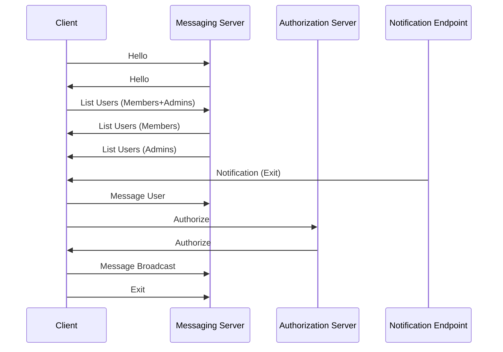

# CHAT-SERVER

# Instructions

1. Client -> Messaging Server ([Hello](#message-type-hello))
1. Messaging Server -> Client ([Hello](#message-type-hello))
1. Client -> Messaging Server ([List Users](#message-type-list-users))
1. Messaging Server -> Client ([List Users (Members)](#message-type-list-users))
1. Messaging Server -> Client ([List Users (Admin)](#message-type-list-users))
1. Client -> Messaging Server ([Message User](#message-type-message-user)): Send a message to the third user from the Member list or any other user for reduced points.
1. Client -> Authorization Server ([Authorize](#message-type-authorize))
1. Authorization Server -> Client ([Authorize](#message-type-authorize)): Receives an authorization code.
1. Client -> Messaging Server ([Broadcast](#message-type-broadcast))
1. Notification Server -> Client ([Exit](#message-type-notification))
1. Client -> Messaging Server ([Exit](#message-type-exit))

# Messaging Endpoint (TCP)

- Port: 31554
- Protocol: TCP

## Message Type: Hello

Describes all available messages known to the server.

**Request**

| Field          | Start Bytes | Length | Pack Type|  Description                  |
| -------------- | ----------- | ------ | ----------------------                   |
| Message Number | 0           | 2      |     h    | Must be the value 50.         |
| Message Length | 2           | 4      |     i    | Total message length.         |
| User Name      | 6           | 32     |     s    | Your username  = first_last   |

**Response**

| Field               | Start Bytes | Length     | Unpack Type   Description                                                  |
| ------------------- | ----------- | ---------- | ------------------------------------------------------------ |
| Message Number      | 0           | 2          |   
| Message Length      | 2           | 4          | Total message length.                                        |
| Token               | 6           | 10         | A user identifier to be included in all subsequent messages. |
| Message Descriptors | 16          | Calculated | Repeating [Message Descriptors](#message-descriptor).        |

## Message Descriptor

| Field               | Start Bytes | Length | Description                                                  |
| ------------------- | ----------- | ------ | ------------------------------------------------------------ |
| Message Number      | 0           | 2      | Message number                                               |
| Message Explanation | 2           | 200    | Semicolon delimited textual explanation of message elements. |

# Message Type: List Users

Lists all users with their roles on the server.

**Request**

| Field          | Start Bytes | Length | Description                                                                                                                |
| -------------- | ----------- | ------ | -------------------------------------------------------------------------------------------------------------------------- |
| Message Number | 0           | 2      | The message number received from the Hello message                                                                         |
| Message Length | 2           | 4      | Total message length                                                                                                       |
| Token          | ?           | 10     | User identification token                                                                                                  |
| User Type      | ?           | 2      | 1: Admin, 2: Member, 3: Members + Admins                                                                                   |
| Filter         | ?           | 32     | Filters users by the start of their name, for example: Av will return all users starting with the name Av [case sensitive] |

**Response**

| Field          | Start Bytes | Length     | Description                                |
| -------------- | ----------- | ---------- | ------------------------------------------ |
| Message Number | 0           | 2          | The message number received from the Hello |
| Message Length | 2           | 4          | Total message length                       |
| User Type      | 6           | 2          | 1: Admin, 2: Member                        |
| Users          | 8           | Calculated | User list (each user is 32 bytes).         |

# Message Type: Message User

Sends a message to a user directly.

**Request**

| Field          | Start Bytes | Length | Description                                |
| -------------- | ----------- | ------ | ------------------------------------------ |
| Message Number | 0           | 2      | The message number received from the Hello |
| Message Length | 2           | 4      | Total message length                       |
| Token          | ?           | 10     | User identification token                  |
| User Name      | ?           | 32     | The target user name.                      |
| Message        | ?           | 1024   | Message content.                           |

# Message Type: Broadcast.

Sends a message to all users.

Requires getting [authorization](#authorization-request) from the server first.

**Request**

| Field           | Start Bytes | Length | Description                                |
| --------------- | ----------- | ------ | ------------------------------------------ |
| Message Number  | 0           | 2      | The message number received from the Hello |
| Message Length  | 2           | 4      | Total message length                       |
| Token           | ?           | 10     | User identification token                  |
| Authorization   | ?           | 10     | Authorization token                        |
| Message content | ?           | 1024   | Message content                            |

**Response**
None

# Message Type: Exit.

Requests the server to exit.

Requires receiving an Exit code from the [Notification Endpoint](#notification-endpoint-udp)

**Request**

- Message number: 99

| Field                | Start Bytes | Length | Description               |
| -------------------- | ----------- | ------ | ------------------------- |
| Message Number       | 0           | 2      | Must be set to 99.        |
| Message Length       | 2           | 4      | Total message length      |
| Token                | 6           | 10     | User identification token |
| Notification Payload | 14          | 20     | Exit code                 |

**Response**
None

# Authorization Endpoint (UDP)

- Port: 31555
- Protocol: UDP

## Message Type: Authorize

**Request**

| Field          | Start Bytes | Length | Description           |
| -------------- | ----------- | ------ | --------------------- |
| Message Number | 0           | 2      | Must be the value 50. |
| Token          | 2           | 10    | The user token.       |

**Response**

| Field              | Start Bytes | Length | Description                                        |
| ------------------ | ----------- | ------ | -------------------------------------------------- |
| Message Number     | 0           | 2      |
| Authorization Code | 2           | 10     | A user identifier to be included in all subsequent |

---

# Notification Endpoint (UDP)

- Port: 31556
- Protocol: UDP

## Message Type: Notification

**Notification**

| Field                | Start Bytes | Length | Description |
| -------------------- | ----------- | ------ | ----------- |
| Notification Type    | 0           | 2      | 1: Exit     |
| Notification Payload | 2           | 20     | Exit code.  |
